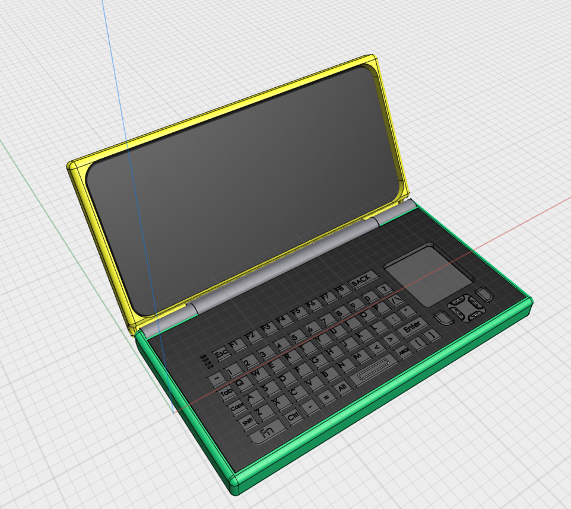
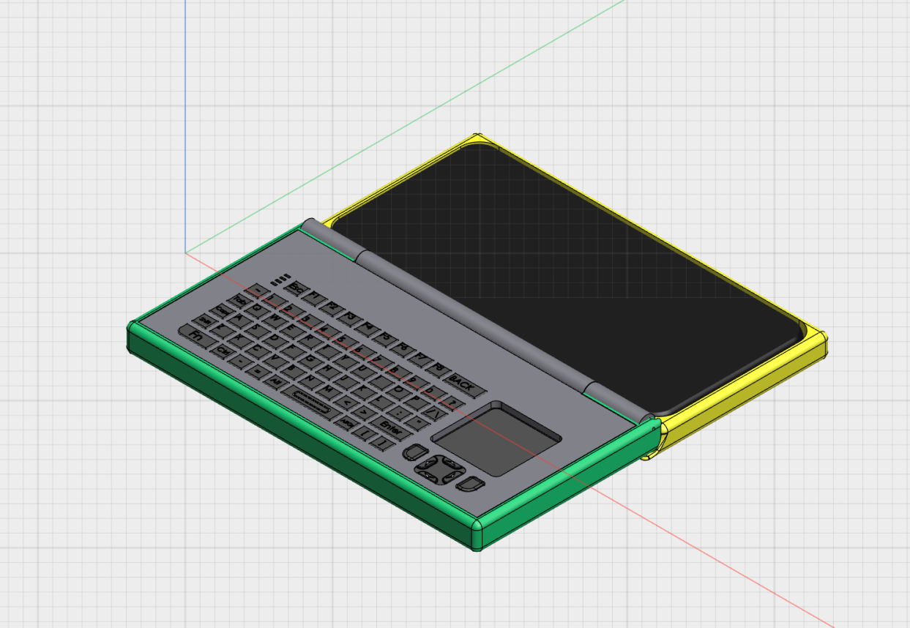

# umpc-phone
Repurpose Redmi Note 9S as ultra mobile pc.

## More Polished Version for Galaxy Z Flip 5/6

  

## Test Print - v0.1
 

  

 

  

# Operating System
### postmarketOS
Disadvantages:
- Touch does not work. (Focaltech)

Advantages:
- Good community

### Ubuntu Touch & Droidian
Disadvantages:
- Halium
- Read only system.
- Unstable

Advantages:
- ?

### LineageOS
Disadvantages:
- Needs more observing as umpc

Advantages:
- Stable

# Hardware

### Keyboard Case

- Need tweaking with hinge, will share cad files later.

### USB C Hub
